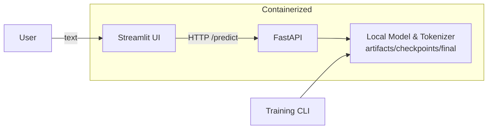

# Real-Time LLM System for Disaster Tweet Classification


> A lightweight multilingual transformer, fine-tuned to classify tweets as **disaster** vs **non-disaster**, served in real time via **FastAPI** and a friendly **Streamlit** UI. Fully containerized with **Docker** (GPU or CPU).

---

<p align="center">
  <!-- Replace with an actual short demo GIF/screencast; keep file small -->
  
  <br/>
  <em>Tip: drop your own GIF at <code>docs/demo.gif</code> to make this banner “animated”.</em>
</p>

---

## Table of Contents

* [What’s Inside](#whats-inside)
* [Architecture](#architecture)
* [Prerequisites](#prerequisites)
* [Quick Start (Windows – PowerShell)](#quick-start-windows--powershell)
* [Quick Start (Linux/macOS – bash/zsh)](#quick-start-linuxmacos--bashzsh)
* [Useful Endpoints & Examples](#useful-endpoints--examples)
* [Artifacts & Files](#artifacts--files)
* [Common Errors & Fixes](#common-errors--fixes)
* [Tips & Performance](#tips--performance)
* [Project Structure](#project-structure)
* [License](#license)

---

## What’s Inside

* ✔️ **Fine-tuned model**: `microsoft/Multilingual-MiniLM-L12-H384`
* 📊 **Metrics**: Accuracy ≈ **88–89%**, F1 ≈ **0.85–0.86** on validation
* ⚙️ **Serving**: **FastAPI** (`/predict`, `/healthz`, `/docs`) + **Streamlit** UI
* 📦 **Dockerized**: GPU-ready (uses CUDA if available); also runs on CPU
* 🔁 **One-command pipeline**: `run_all.ps1` to train → serve API → launch UI
* 🧳 **Offline-first**: UI & API load the **local checkpoint** (no HF Hub needed)

---

## Architecture



---

## Prerequisites

* **Docker Desktop** (Windows with WSL2 recommended; Linux/macOS Docker works too)
* (Optional) **NVIDIA GPU** + drivers + **NVIDIA Container Toolkit** for GPU acceleration
* **Internet** for the first model pull *(training)*; serving uses local artifacts

> **Windows PowerShell** may block scripts on first run. Use `-ExecutionPolicy Bypass` or `Unblock-File .\run_all.ps1`.

---

## Quick Start (Windows – PowerShell)

**A) Train + Launch (recommended on first run)**

```powershell
# 1) From repo root (folder containing artifacts/ and data/processed/)
$Image = 'sandeep_pandey/crisis-llm:gpu-latest'

# 2) Train + start API (FastAPI) + UI (Streamlit)
powershell -NoProfile -ExecutionPolicy Bypass -File .\run_all.ps1 -Image $Image
```

Open:

* API docs → [http://localhost:8000/docs](http://localhost:8000/docs)
* Streamlit UI → [http://localhost:8501](http://localhost:8501)

> Use custom ports:
>
> ```powershell
> powershell -NoProfile -ExecutionPolicy Bypass -File .\run_all.ps1 -Image $Image -ApiPort 8010 -UiPort 8510
> ```

**B) Start Only (if you already trained)**

```powershell
$Image   = 'sandeep_pandey/crisis-llm:gpu-latest'
$Arts    = "$PWD\artifacts"
$ApiPort = 8010
$UiPort  = 8510

docker rm -f crisis-api crisis-ui 2>$null | Out-Null

# API
docker run -d --rm --name crisis-api --gpus all `
  -p ${ApiPort}:8000 `
  -v "${Arts}:/app/artifacts" `
  -e MODEL_DIR="/app/artifacts/checkpoints/final" `
  -e HF_HUB_OFFLINE=1 -e TRANSFORMERS_OFFLINE=1 `
  $Image uvicorn ai_tweets.api:app --host 0.0.0.0 --port 8000 --log-level info

# UI (uses local artifacts only; no Hub lookups)
docker run -d --rm --name crisis-ui --gpus all `
  -p ${UiPort}:8501 `
  -v "${Arts}:/app/artifacts" `
  -e MODEL_DIR="/app/artifacts/checkpoints/final" `
  -e HF_HUB_OFFLINE=1 -e TRANSFORMERS_OFFLINE=1 `
  $Image streamlit run src/ai_tweets/streamlit_app.py --server.port 8501 --browser.gatherUsageStats false
```

---

## Quick Start (Linux/macOS – bash/zsh)

```bash
# Repo root
Image='sandeep_pandey/crisis-llm:gpu-latest'

# Train + launch (CPU or GPU)
bash -lc 'pwsh -NoProfile -ExecutionPolicy Bypass -File ./run_all.ps1 -Image '"$Image"
# Or start-only with docker run commands analogous to the Windows section
```

> If you don’t have PowerShell, you can translate the `docker run` commands from the Windows section to bash (identical flags).

---

## Useful Endpoints & Examples

**Swagger UI**

* `GET /docs` → interactive docs

**Health**

* `GET /healthz` → `{"ok": true}` when API is ready

**Prediction (PowerShell)**

```powershell
$ApiPort = 8000
$body = @{ text = "Wildfire near the highway, evacuations underway" } | ConvertTo-Json
Invoke-RestMethod -Method Post -Uri "http://127.0.0.1:${ApiPort}/predict" -ContentType "application/json" -Body $body
```

**Prediction (curl)**

```bash
curl -X POST "http://localhost:8000/predict" \
  -H "Content-Type: application/json" \
  -d '{"text":"Wildfire near the highway, evacuations underway"}'
```

---

## Artifacts & Files

After training, you should have:

```
artifacts/checkpoints/final/
├─ config.json
├─ model.safetensors
├─ tokenizer.json
├─ tokenizer_config.json
├─ special_tokens_map.json
└─ sentencepiece.bpe.model
```

The UI & API both load the **local** model from this directory (`MODEL_DIR=/app/artifacts/checkpoints/final` inside containers).

---

## Common Errors & Fixes

### 1) **Script is not digitally signed** (Windows)

**Error**

```
... run_all.ps1 is not digitally signed. You cannot run this script ...
```

**Fix**

* Use the bypass flag:

  ```powershell
  powershell -NoProfile -ExecutionPolicy Bypass -File .\run_all.ps1 -Image $Image
  ```
* Or: `Unblock-File .\run_all.ps1`

---

### 2) **Ports already allocated**

**Error**

```
Bind for 0.0.0.0:8000 failed: port is already allocated
Bind for 0.0.0.0:8501 failed: port is already allocated
```

**Fix**

* Stop old containers:

  ```powershell
  docker rm -f crisis-api crisis-ui
  ```
* Or use different ports:

  ```powershell
  -ApiPort 8010 -UiPort 8510
  ```

---

### 3) **Empty reply from server** on `/healthz` or `/predict`

**Symptoms**

* `curl: (52) Empty reply from server`
* FastAPI container just started and is warming up
  **Fix**
* Wait a few seconds and retry.
* Check container logs:

  ```powershell
  docker logs crisis-api --tail 200
  ```

---

### 4) **HFValidationError** in Streamlit (loading local path)

**Error**

```
HFValidationError: Repo id must be in the form 'repo_name' or 'namespace/repo_name': '/app/artifacts/checkpoints/final'
```

**Why**

* `pipeline()` without “local only” semantics tries to treat the path like a hub repo id.
  **Fix**
* The included `streamlit_app.py` **forces local loading**:

  ```python
  tok = AutoTokenizer.from_pretrained(MODEL_DIR, local_files_only=True)
  mdl = AutoModelForSequenceClassification.from_pretrained(MODEL_DIR, local_files_only=True)
  ```
* Ensure `MODEL_DIR=/app/artifacts/checkpoints/final` is set and the directory contains the files listed in **Artifacts & Files**.

---

### 5) **Accelerate unwrap\_model keep\_torch\_compile error during training**

**Error**

```
TypeError: Accelerator.unwrap_model() got an unexpected keyword argument 'keep_torch_compile'
```

**Fix**

* We upgrade `accelerate` in-container before training (already handled by the training command). If you train manually, run:

  ```bash
  python -m pip install --upgrade "accelerate>=1.2.1"
  ```
* Then re-run training.

---

### 6) **DNS / HF transfer transient warnings**

**Error Snippets**

```
... xethub.hf.co ... dns error ... failed to lookup address information ...
```

**Fix**

* These are usually transient network issues or due to running in offline mode. For serving, we set:

  ```bash
  HF_HUB_OFFLINE=1
  TRANSFORMERS_OFFLINE=1
  ```
* Ensure your **artifacts folder is complete** so no downloads are needed during serving.

---

### 7) **PowerShell quoting / JSON escaping pitfalls**

**Symptoms**

* Weird errors from `curl` or variables like `:`
  **Fix**
* Prefer `Invoke-RestMethod` for JSON, or use `curl.exe` (not the PowerShell alias).
* When a variable with `:` is inside quotes, use `${Var}` form in PS:

  ```powershell
  -p ${ApiPort}:8000
  ```

---

### 8) **No such container** when viewing logs

**Error**

```
Error response from daemon: No such container: crisis-api
```

**Fix**

* Start the container first (see Quick Start).
* Or the container exited—check `docker ps -a`.

---

## Tips & Performance

* **GPU vs CPU**: If GPU is available, the containers will use it; else run on CPU (slower but OK).
* **Batch predictions**: Add an endpoint or client batching for throughput.
* **Further speedups**: Quantization (e.g., `bitsandbytes`) or distillation if targeting CPU-only.

---

## Project Structure

```
.
├─ artifacts/
│  └─ checkpoints/
│     └─ final/               # saved model & tokenizer (after training)
├─ data/
│  └─ processed/
│     ├─ train.csv
│     └─ val.csv
├─ src/
│  └─ ai_tweets/
│     ├─ api.py               # FastAPI app
│     ├─ cli.py               # Training entrypoint
│     ├─ streamlit_app.py     # UI (local/offline model loading)
│     └─ train.py             # Trainer (HF Transformers)
├─ configs/
│  └─ gpu.yaml                # training config (epochs, batch size, etc.)
├─ run_all.ps1                # one-command train + serve script (Windows)
└─ README.md
```

---

## License

This project is released under the **MIT License**. See `LICENSE` for details.

---

### Acknowledgements

* Hugging Face 🤗 Transformers & Datasets
* FastAPI, Uvicorn
* Streamlit
* Docker & NVIDIA Container Toolkit

---
